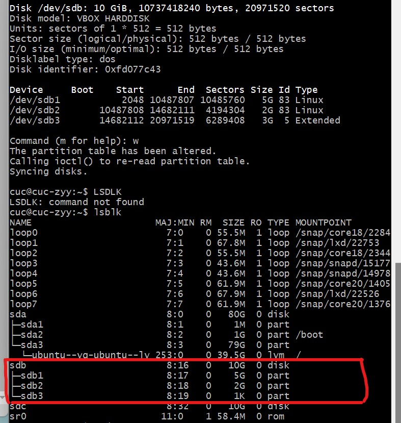

#   实验目的与自评  

- 对Linux服务器系统管理基础有更深入的了解，例如用户/组与权限管理、文件系统与存储管理、文件备份与恢复、开机自启动项管理……


#   实验步骤与结果

**实验环境** 
- 虚拟机中下载的老师给的百度云链接 
- Linux Ubuntu20.04 以及 阿里云提供的Linux指令入门操作平台


##  动手实战Systemd

###  Systemd 入门教程：命令篇 by 阮一峰的网络日志

systemctl部分的操作无法用asciinema录屏，故用截图代替：

- 执行 `sudo systemctl reboot` 重启系统


- 执行 `sudo systemctl poweroff` 关闭系统，切断电源


- 执行 `sudo systemctl halt` CPU停止工作


- 执行 `sudo systemctl suspend` 暂停系统


- 执行 `sudo systemctl hibernate` 让系统进入冬眠状态


- 执行 `sudo systemctl hybrid-sleep` 让系统进入交互式休眠状态


- 执行 `sudo systemctl rescue` 启动进入救援状态（单用户状态）


- 录屏链接

  - Ubutu 

    - [asciinema-3.2-3.6](https://asciinema.org/a/480947)

    - [asciinema-unit](https://asciinema.org/a/480960) 

    - [asciinema-target&journalctl](https://asciinema.org/a/480965)

  - CentOS

    - [asciinema-入门教程跟练](https://asciinema.org/a/481745)


###  Systemd 入门教程：实战篇 by 阮一峰的网络日志

- 录屏链接
  - [asciinema-Ubuntu实战](https://asciinema.org/a/480975)
  - [asciinema-CentOS实战](https://asciinema.org/a/481751)


##  本章完成后的自查清单

###  添加一个用户并使其具备sudo执行程序的权限并将一个用户添加到一个用户组

- `sudo adduser zhang` 添加用户

- `cat /etc/passwd` 查看用户

- `id zhang` 査询用户的UID、GID 和附加组的信息 

- `sudo usermod -G sudo zhang` 使用户具备sudo执行程序的权限

- `sudo usermod -a -G 1000 zhang` 将一个用户添加到一个用户组


- 录屏链接

  - [asciinema-user_management_Ununtu](https://asciinema.org/a/480979)

  - [asciinema-user_management_CentOS](https://asciinema.org/a/481754)


###  查看当前系统的分区表和文件系统详细信息

- `df -lh` 查看磁盘的使用情况以及文件系统被挂载的位置 

- `fdisk -l` 所有的硬盘的分区情况 


- 录屏链接

  - [asciinema-partiton_Ubuntu](https://asciinema.org/a/480983)

  - [asciinema-partition_CentOS](https://asciinema.org/a/481756)


###  如何实现开机自动挂载Virtualbox的共享目录分区?

- 首先在对应虚拟机中设置添加共享文件夹


- 接着启动虚拟机

- 执行 `sudo nano /lib/systemd/system/rc-local.service` 

- 编辑rc-local.service，最后追加 `[Install] WantedBy=multi-user.target Alias=rc-local.service` 


- 退出编辑后执行 `sudo nano /etc/rc.local` 填写 `#!/bin/sh mount -t vboxsf shared /mnt/shared exit 0` 


- 执行 `sudo mkdir /mnt/shared` 新建连接文件夹

- 执行 `sudo ln -s /lib/systemd/system/rc-local.service /etc/systemd/system/` 在/systemd/system下创建软链接

- 在/mnt/shared下可以已经挂载文件夹的内容


- 在网上寻找教程还有另外一种操作方式实现开机自动挂载：

  - 执行 `sudo gedit /etc/fstab` 

  - 在文件末添加 `virtualbox_share /mnt/shared/ vboxsf defaults 0 0` 


###  基于LVM(逻辑分卷管理)的分区实现动态扩容和缩减容量

- 首先在SATA控制器下添加虚拟硬盘


- 分别使用 `fdisk` 和 `gdisk` 指令 进行分区操作





- 使用 `pvcreate` 命令将物理硬盘分区初始化为物理卷，以便LVM使用

- 执行 `pvscan` 命令扫描系统中连接的所有硬盘，列出找到的物理卷列表

- 执行 `pvs` 命令输出格式化的物理卷信息报表

- 使用 `vgcreate` 命令创建LVM卷组

- 执行 `vgs` 命令报告关于卷组的信息


- 通过 `lvresize` 指令来实现分区的动态扩容和缩减容量

  - `lvresize -L|--size [+|-]Size[m|UNIT] LV` 直接增减容量

  - `lvresize -l|--extents [+|-]Number[PERCENT] ]` 按一定比例增减

- 执行 `lvdisplay` 命令显示LVM逻辑卷空间大小、读写状态和快照信息等属性


###  通过systemd设置实现在网络连通时运行一个指定脚本，在网络断开时运行另一个脚本

- `/etc/systemd/system`目录里创建`start-on.service` 并编辑文件

```bash
[Unit]
Description=a service can be started when network is available
Requires=systemd-network.service
After=network.target

[Service]
Type=oneshot
ExecStart=/bin/bash /home/start_available.sh
ExecStopPost=/bin/bash /home/start_unavailable.sh
RemainAfterExit=yes
Restart=on-abnormal

[Install]
WantedBy=multi-user.target
```  

网络连通时执行`start_available.sh`
断开时执行`start_unavailable.sh.sh`

```bash
#start_available.sh
#!/bin/bash
echo "start when available" >> /home/display.txt

#start_unavailable.sh
#!/bin/bash
echo "start when unavailable" >> /home/display.txt
```


###  通过svstemd设置实现一个脚本在任何情况下被杀死之后会立即重新启动，实现杀不死

- 编辑文件
  
```bash
[Service]
Restart=always
```


#   问题分析与解决  
1.  fdisk -l 显示Permission denied


- 解决方法：用sudo权限下达指令

2.  在CentOS环境中，执行`sudo usermod -G sudo zhang` 使用户具备sudo执行程序的权限失败

- 原因分析：在CentOS环境中，不存在名为sudo的用户组，根据用户情况显示，root权限用户组名就是root

- 解决方法：执行`sudo usermod -G root zhang` 


3.  在使用`gedit`指令时显示 Unable to init server
   


- 解决方法：根据网上给的解答方法，选择了用指令 `nano` 替代原来的方法
  


#   参考链接  

[Systemd 入门教程：命令篇 by 阮一峰的网络日志](http://www.ruanyifeng.com/blog/2016/03/systemd-tutorial-commands.html)


[Systemd 入门教程：实战篇 by 阮一峰的网络日志](http://www.ruanyifeng.com/blog/2016/03/systemd-tutorial-part-two.html)


[Linux添加用户（user）到用户组（group）](https://blog.csdn.net/weixin_41282397/article/details/81113014)

[Linux 磁盘分区表、文件系统的查看](https://blog.csdn.net/hhbbhh/article/details/5492383)

[virtualbox下怎么实现ubuntu20.04开机自动挂载共享文件夹](https://www.html.cn/system/unix/1118508239025.html)

[Virtualbox实现共享文件夹并自动挂载](https://blog.csdn.net/hexf9632/article/details/93774198)

[错误处理:Unable to init server](https://blog.csdn.net/Gloriiiaaa/article/details/109794696)

[Linux添加自定义服务（service文件）](https://blog.csdn.net/yanhanhui1/article/details/117196904)

[Linux中退出编辑模式的命令](https://www.cnblogs.com/sunshc/p/10875400.html)

