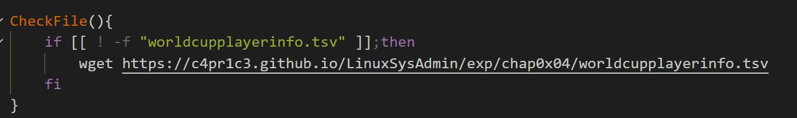

#   实验目的与自评   

 - 目的：建立shell脚本编程基础
 - 自评：本次实验代码部分参考较多，自主编程能力还需锻炼提升，总体上完成了每项任务，但未能构建自己的Travis仓库


#   实验步骤与结果  

**实验环境**   
- 虚拟机：Virtualbox Ubuntu 20.04 Server 64bit (老师给的百度云链接)
- 操作平台：VScode远程连接到虚拟机

**实验准备** 
- 数据传输
  - 方法一：通过`scp`指令，将所需要操作的数据文件传输到虚拟机上
    
  - 方法二：在bash编写中通过`wget`指令，下载所需数据文件
    

- 软件下载&更新
  - `sudo apt-get update`
  - `sudo apt-get install -y shellcheck ` 
  - `sudo apt-get install -y p7zip-full`
  - `sudo apt-get install -y imagemagick `
  - `sudo apt-get install -y ghostscript`
  -  

**任务一：用bash编写一个图片批处理脚本，实现以下功能：**
- 支持命令行参数方式使用不同功能
   - 使用 getopt 处理多命令行选项
- 支持对指定目录下所有支持格式的图片文件进行批处理
   - 方法一：使用magick里面的命令 identify -format "%m" 文件名 查看文件的真实类型
   - 方法二：执行脚本前 ls 指定输出目录，执行脚本后再 ls 指定输出目录，对比脚本执行前后的目录内容差异
- 支持以下常见图片批处理功能的单独使用或组合使用
```bash
#对jpeg格式图片进行图片质量压缩
convert -strip -interlace Plane -gaussian-blur 0.01 -quality "$Q" "$jpg" "$jpg"

#对jpeg/png/svg格式图片在保持原始宽高比的前提下压缩分辨率
convert -resize "$R" "$img" "$img"

#支持对图片批量添加自定义文本水印
#加非透明水印时
convert "${img}" -pointsize "$size" -fill 'rgba(221, 34, 17, 0.25)' 
-gravity "$position" -draw "text 10,10 '$content'" "${img}"
#加透明水印时
convert  -size 100x100  xc:none  
-fill '#d90f02'  -pointsize "$size"  -font 'cochin.ttc'  
-gravity "$position" -draw "rotate -45 text 0,0 '$content'"  
-resize 60%  miff:-  |  composite  -tile  -dissolve 25  -  "$img"  "$img"

#支持批量重命名（统一添加文件名前缀或后缀，不影响原始文件扩展名）
#添加前缀
name=${img##*/}
new_name=$1"/"${prefix}${name}
mv "${img}" "${new_name}"
#添加后缀
new_name=${img%.*}${suffix}"."${type}
mv "${img}" "${new_name}"

#支持将png/svg图片统一转换为jpg格式图片
new_img=${img%.*}".jpg"
convert "${img}" "$new_img"
```

- 代码编写：[bash-picturebatch](./bash/picturebatch.sh)
- 运行操作与结果： 
  - ` shellcheck picturebatch.sh`
  - ` bash picturebatch.sh -h`
  - ` bash picturebatch.sh -q ./img 90`
  - ` bash picturebatch.sh -r ./img 99%`
  - ` bash picturebatch.sh -w ./img yyc center 200 `
  - ` bash picturebatch.sh -p ./img Pre`
  - ` bash picturebatch.sh -s ./img Suf`
  - `bash picturebatch.sh -t ./img`
  


**任务二：用bash编写一个文本批处理脚本，对以下附件分别进行批量处理完成相应的数据统计任务：**

- *2014世界杯运动员数据*
  - 代码编写：[bash-filebatch_players](./bash/filebatch_players.sh)
  - 统计结果：[report-filebatch_players](./players_report.md)
  - 运行操作：
    - `shellcheck filebatch_players.sh`
    - `bash filebatch_players.sh -h`
    - `bash filebatch_players.sh -a`
    - `bash filebatch_players.sh -p`
    - `bash filebatch_players.sh -n`
    - `bash filebatch_players.sh -m`
    

- *Web服务器访问日志*
  - 代码编写：[bash-filebatch_weblog](./bash/filebatch_weblog.sh)
  - 统计结果：[report-filebatch_weblog](./weblogs_report.md)
  - 运行操作：
    - `shellcheck task3.sh`
    - `echo Task3`
    - `bash task3.sh - h`
    - `bash task3.sh -t`
    - `bash task3.sh -i`
    - `bash task3.sh -u`
    - `bash task3.sh -s`
    - `bash task3.sh -c`
    - `bash task3.sh -f /images/NASA-logosmall.gif`
    
    
    
    
    

**报告整理**
- 通过`scp`指令将虚拟机中的bash文件传输到宿主机上
  
- 实验报告中源代码文件在 *bash文件夹* 下
- 任务二中所收集的数据(另外两个md文件)进行了后期表格化修饰


#   问题分析与解决 
- 问题一
  - 描述：在任务一中对图片进行处理，已经将图片和bash文件放在一个文件夹中，却显示`Not a directory`
  - 分析：通过查询此段函数的源代码发现此处不应该写文件名，而应该写文件所在的文件夹路径
  - 解决：在bash文件所在的文件夹中再建立test_img文件夹，将需要进行操作的图片放进去
  
  

- 问题二
  - 描述：在提交作业时push失败
  - 分析：存在文件大小超过100MB
  - 解决：发现该文件并非报告文件，而是原始数据，故选择使用`git filer-branch`删除
  
  


#   参考链接  
[CUCCS/2021-linux-public-kal1x/chap0x04](https://github.com/CUCCS/2021-linux-public-kal1x/tree/chap0x04/chap0x04)  

[shell命令行选项与参数处理--getopt](https://blog.csdn.net/u011285208/article/details/81194295)  

[Command-line Tools: Magick - ImageMagick](https://imagemagick.org/script/magick.php)  

[wget命令详解](https://www.cnblogs.com/sx66/p/11887022.html)  
