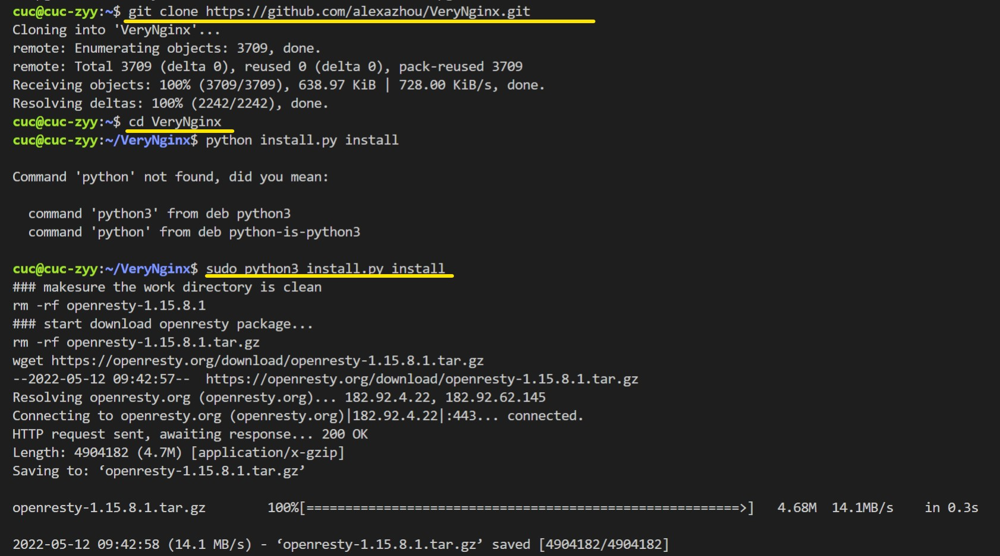
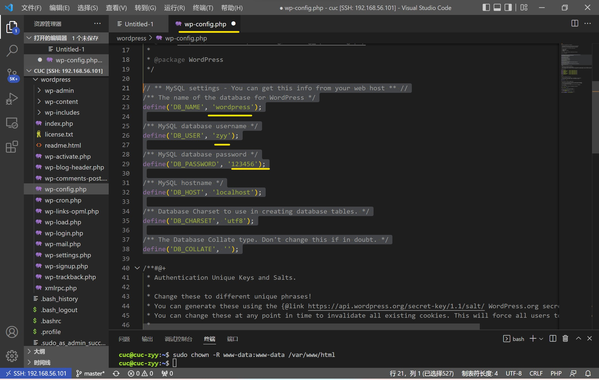

#   实验目的、自评与与完成情况

- 目的：深化对web服务器的理解

- 自评：完成了实验要求的所有任务，收获满满

- 完成情况：
  - 1.  基本要求 
    - [x] 在一台主机（虚拟机）上同时配置Nginx和VeryNginx
      - [x] VeryNginx作为本次实验的Web App的反向代理服务器和WAF
      - [x] PHP-FPM进程的反向代理配置在nginx服务器上，VeryNginx服务器不直接配置Web站点服务
    - [x] 使用Wordpress搭建的站点对外提供访问的地址为： http://wp.sec.cuc.edu.cn
    - [x] 使用Damn Vulnerable Web Application (DVWA)搭建的站点对外提供访问的地址为： http://dvwa.sec.cuc.edu.cn

  - 2.  安全加固要求
    - [x] 使用IP地址方式均无法访问上述任意站点，并向访客展示自定义的友好错误提示信息页面-1
    - [x] Damn Vulnerable Web Application (DVWA)只允许白名单上的访客来源IP，其他来源的IP访问均向访客展示自定义的友好错误提示信息页面-2
    - [x] 在不升级Wordpress版本的情况下，通过定制VeryNginx的访问控制策略规则，热修复WordPress < 4.7.1 - Username Enumeration
    - [x] 通过配置VeryNginx的Filter规则实现对Damn Vulnerable Web Application (DVWA)的SQL注入实验在低安全等级条件下进行防护

  - 3.  VeryNginx配置要求
    - [x] VeryNginx的Web管理页面仅允许白名单上的访客来源IP，其他来源的IP访问均向访客展示自定义的友好错误提示信息页面-3
     - [x] 通过定制VeryNginx的访问控制策略规则实现：
      - [x] 限制DVWA站点的单IP访问速率为每秒请求数 < 50
      - [x] 限制Wordpress站点的单IP访问速率为每秒请求数 < 20
      - [x] 超过访问频率限制的请求直接返回自定义错误提示信息页面-4
      - [x] 禁止curl访问


#   实验步骤与结果

**实验环境** 
- 虚拟机：Virtualbox Ubuntu 20.04 Server 64bit (老师给的百度云链接)
- 操作平台：VScode远程连接到虚拟机

**基本要求实现（实验准备）** 
- 修改windows的hosts文件
  - windows+x键打开，点击windows终端（管理员），输入notepad，打开文件后选择在drivers文件夹里的hosts修改。
    ```
    # web
    192.168.56.101 vn.sec.cuc.edu.cn
    192.168.56.101 dvwa.sec.cuc.edu.cn
    192.168.56.101 wp.sec.cuc.edu.cn
    ```
    

- 进行更新   `sudo apt update`

- 安装配置nginx
  
  - 首先安装php相关文件
    `sudo apt install php-fpm php-mysql php-curl php-gd php-intl php-mbstring php-soap php-xml php-xmlrpc php-zip`
    

  - 下载nginx
    `sudo apt install nginx`
    

  - 配置nginx
    `sudo vim /etc/nginx/sites-enabled/default`
    进行修改：
    ```
    root /var/www/html/wp.sec.cuc.edu.cn;

    # Add index.php to the list if you are using PHP
    index readme.html index.php;

    location ~ \.php$ {
	    #	include snippets/fastcgi-php.conf;
	    #
	    #	# With php-fpm (or other unix sockets):
		    fastcgi_pass unix:/var/run/php/php7.4-fpm.sock;
		    fastcgi_index index.php;
	    	fastcgi_param SCRIPT_FILENAME $document_root$fastcgi_script_name;
	    	include fastcgi_params;
    	#	# With php-cgi (or other tcp sockets):
    	#	fastcgi_pass 127.0.0.1:9000;
    	}
    ```
    

- 安装配置veryngnix
   
  - 首先下载以下库
    ```
    # zlib
    sudo apt-get install zlib1g-dev
    # pcre
    sudo apt-get install libpcre3 libpcre3-dev
    # gcc 
    sudo apt install gcc
    # make
    sudo apt install make
    # penssl library
    sudo apt install libssl-dev
    ```

  - 然后将verynginx库克隆至本地，打开VeryNginx目录，查看是否安装python3，用python3下载文件。
    ```
    git clone https://github.com/alexazhou/VeryNginx.git
    cd VeryNginx
    sudo python3 install.py install
    ```
    

  - 配置verynginx
    `sudo vim /opt/verynginx/openresty/nginx/conf/nginx.conf`
    ```
    # 用户名
    user  www-data;

    # 监听端口
    server {
        listen 192.168.43.3:80;
        
        #this line shoud be include in every server block
        include /opt/verynginx/verynginx/nginx_conf/in_server_block.conf;

        location = / {
            root   html;
            index  index.html index.htm;
          }
    ```
    

  - 给相关权限
    `sudo chmod -R 777 /opt/verynginx/verynginx/configs`

  - 启动verynginx
    `sudo /opt/verynginx/openresty/nginx/sbin/nginx`

  - 在主机网页输入ip:+端口号+/verynginx/index.html，账号名和密码为：verynginx/verynginx
    
    

- 安装配置wordpress
  
  - 首先下载7z解压缩软件
    `sudo apt install p7zip-full`

  - 下载安装包并解压
    ```
    sudo wget https://wordpress.org/wordpress-4.7.zip
    7z x wordpress-4.7.zip
    ```

  - 把wordpress移动到指定路径
    ```
    sudo mkdir /var/www/html/wp.sec.cuc.edu.cn
    sudo cp wordpress /var/www/html/wp.sec.cuc.edu.cn
    ```
    

  - 安装mysql，进入后创建用户
    ```
    sudo apt install mysql-server
    sudo mysql
    CREATE DATABASE wordpress DEFAULT CHARACTER SET utf8 COLLATE utf8_unicode_ci;
    create user 'zyy'@'localhost' identified by '123456';
    grant all on wordpress.* to 'zyy'@'localhost';
    ```
    

  - 修改配置文件并更改名称
    `sudo vim wp-config-sample.php`
    ```
    // ** MySQL settings - You can get this info from your web host ** //
    /** The name of the database for WordPress */
    define( 'DB_NAME', 'wordpress' );

    /** MySQL database username */
    define( 'DB_USER', 'zyy' );

    /** MySQL database password */
    define( 'DB_PASSWORD', '123456' );

    /** MySQL hostname */
    define( 'DB_HOST', 'localhost' );

    /** Database charset to use in creating database tables. */
    define( 'DB_CHARSET', 'utf8' );

    /** The database collate type. Don't change this if in doubt. */
    define( 'DB_COLLATE', '' );
    ``` 
    `mv wp-config-sample.php wp-config.php`
    


  - 配置服务器
    `sudo vim /etc/nginx/sites-available/wp.sec.cuc.edu.cn`
    ```
    server {
	    listen 8001 default_server;

        root /var/www/html/wp.sec.cuc.edu.cn;
        index index.php index.html index.htm index.nginx-debian.html;
        server_name wp.sec.cuc.edu.cn;

        location / {
            # try_files $uri $uri/ =404;
            try_files $uri $uri/ /index.php$is_args$args;
        }

          location ~ \.php$ {
          include snippets/fastcgi-php.conf;
          fastcgi_pass unix:/var/run/php/php7.4-fpm.sock;
          }

        location ~ /\.ht {
            deny all;
        }
    }
    ```
    

  - 在主机网页输入ip:+端口号+/wordpress/wp-admin/setup-config.php进入如下下界面：
    

- DVWA安装与配置

  - 下载DVWA
    ```
    # 下载
    git clone https://github.com/digininja/DVWA.git
    # 建立目录
    sudo mkdir /var/www/html/dvwa.sec.cuc.edu.cn
    # 移动文件夹内容至该目录下
    sudo mv DVWA/* /var/www/html/dvwa.sec.cuc.edu.cn
    ```

  - 为DVWA建立数据库
    ```
    mysql> create database dvwa;
    Query OK, 1 row affected (0.00 sec)

    mysql> create user dvwa@localhost identified by 'p@ssw0rd';
    Query OK, 0 rows affected (0.01 sec)

    mysql> grant all on dvwa.* to dvwa@localhost;
    Query OK, 0 rows affected (0.01 sec)

    mysql> flush privileges;
    Query OK, 0 rows affected (0.00 sec)

    mysql> exit;
    ```    
    

  - 配置php
    ```
    # 进入/var/www/html/dvwa.sec.cuc.edu.cn/config/目录下的config.inc.php.dist文件
    # 改名为config.inc.php
    sudo mv config.inc.php.dist config.inc.php
    ```
    接着修改php-fpm的文件
    ```
    sudo vim /etc/php/7.4/fpm/php.ini 
    # 修改内容
    allow_url_include = on
    allow_url_fopen = on
    display_errors = off
    #重启php
    systemctl restart php7.4-fpm.service
    #将所有权分配给www-data用户和组
    sudo chown -R www-data.www-data /var/www/html/dvwa.sec.cuc.edu.cn
    ```

  - 配置服务器
    `sudo vim /etc/nginx/sites-available/dvwa.sec.cuc.edu.cn`
    ```
    server {
        listen 8080 default_server;
        listen [::]:8080 default_server;
	
        root /var/www/html/dvwa.sec.cuc.edu.cn;
        index index.php index.html index.htm index.nginx-debian.html;
        server_name dvwa.sec.cuc.edu.cn;

        location / {
            #try_files $uri $uri/ =404;
            try_files $uri $uri/ /index.php$is_args$args;  
        }

        location ~ \.php$ {
            include snippets/fastcgi-php.conf;
            fastcgi_pass unix:/var/run/php/php7.4-fpm.sock;
        }

        location ~ /\.ht {
            deny all;
        }
    }
    ```
    

  - 在主机网页输入ip:+端口号+/setup.php，账号名和密码为：admin/123456
    
    

- PHP-FPM进程的反向代理
  - 创建到新服务器块的文件链接
  `sudo ln -s /etc/nginx/sites-available/wp.sec.cuc.edu.cn /etc/nginx/sites-enabled/`
  - 取消链接默认配置文件
  `sudo unlink /etc/nginx/sites-enabled/default`
  - 重启并测试  
    ```
    sudo systemctl restart nginx.service 
    sudo nginx -t
    ```
    

- 在完成以下任务前首先配置 wp.sec.cuc.edu.cn 和 dvwa.sec.cuc.edu.cn，添加matcher  
  
  
**安全加固要求实现**

- 使用IP地址方式均无法访问上述任意站点，并向访客展示自定义的友好错误提示信息页面-1
  
  
  
  

- Damn Vulnerable Web Application (DVWA)只允许白名单上的访客来源IP，其他来源的IP访问均向访客展示自定义的友好错误提示信息页面-2
  
  
  
  


- 在不升级Wordpress版本的情况下，通过定制VeryNginx的访问控制策略规则，热修复WordPress < 4.7.1 - Username Enumeration
  
  
  

- 通过配置VeryNginx的Filter规则实现对Damn Vulnerable Web Application (DVWA)的SQL注入实验在低安全等级条件下进行防护
  
  


**VeryNginx配置要求实现**
- VeryNginx的Web管理页面仅允许白名单上的访客来源IP，其他来源的IP访问均向访客展示自定义的友好错误提示信息页面-3
  
  
  
  

- 通过定制VeryNginx的访问控制策略规则实现：

  - 限制DVWA站点的单IP访问速率为每秒请求数 < 50
  - 限制Wordpress站点的单IP访问速率为每秒请求数 < 20
    

  - 超过访问频率限制的请求直接返回自定义错误提示信息页面-4
    

  - 禁止curl访问
    
    
    


#   问题分析与解决 

- 问题一：
  - 描述：vim 报错:Can't open file for writing
    
  - 分析：我猜测可能我的ngnix.conf的位置与教程中的不一样，在网上搜索发现出现这样的报错也有可能是文件夹并不存在
  - 解决：通过`ls`指令一层层寻找，发现教程路径下的文件夹我并没有，当时没有想到可能VeryNginx的安装有问题（在出现问题二的时候经过排查才发现实际上是这个原因），直接在VScode左侧找到了ngnix.conf的文件进行编辑，不采用vim的方法进行编辑。
    

- 问题二：
  - 描述：在进行到“给VeryNginx权限”的时候，按照教程的步骤输入指令，却发现不存在该文件。
    
  - 分析：通过`ls`我发现在/opt下确实没有文件，且安装过程出现问题，就是VeryNginx安装出现了问题。
    
  - 解决：问题出在我没有在opt目录下进行安装，在畅课讨论区有同学出现了和我一样的问题，于是按照他的方法进行改正，先把需要的软件下载完，再克隆仓库、进行下载，成功!
    

- 问题三：
  - 描述：在完成`VeryNginx的Web管理页面仅允许白名单上的访客来源IP，其他来源的IP访问均向访客展示自定义的友好错误提示信息页面-3`所要求的配置后，进行测试，发现展示的错误提示信息页面是-1
  - 分析：此前已经成功完成了`使用IP地址方式均无法访问上述任意站点，并向访客展示自定义的友好错误提示信息页面-1`的配置，若利用ip地址的访问方式，这两个会产生冲突，-3的报错会被-1取代。
  - 解决：先把`使用IP地址方式均无法访问上述任意站点，并向访客展示自定义的友好错误提示信息页面-1`的配置的filter删除，进行`VeryNginx的Web管理页面仅允许白名单上的访客来源IP，其他来源的IP访问均向访客展示自定义的友好错误提示信息页面-3`的配置测试，成功显示设置自定义错误提示界面。
    


#   参考链接 

- [github-linux-2020-LyuLumos](https://github.com/CUCCS/linux-2020-LyuLumos/blob/ch0x05/ch0x05/%E7%AC%AC%E4%BA%94%E6%AC%A1%E5%AE%9E%E9%AA%8C%E6%8A%A5%E5%91%8A.md)
- [VeryNginx_github](https://github.com/alexazhou/VeryNginx/blob/master/readme_zh.md)
- [vi编辑器使用方法](https://www.php.cn/linux-434757.html)
- [how-to-install-wordpress-with-lemp-on-ubuntu-20-04](https://www.digitalocean.com/community/tutorials/how-to-install-wordpress-with-lemp-on-ubuntu-20-04)
- [vi或vim命令 报错:Can't open file for writing](https://blog.csdn.net/weixin_44404862/article/details/101064589)
- [避坑【VeryNginx的安装】](http://courses.cuc.edu.cn/course/82669/forum#/topics/284731?show_sidebar=false&scrollTo=topic-284731&pageIndex=1&pageCount=1&topicIds=290623,290083,289714,285751,285211,284851,284731,284527,277591&predicate=lastUpdatedDate&reverse)
